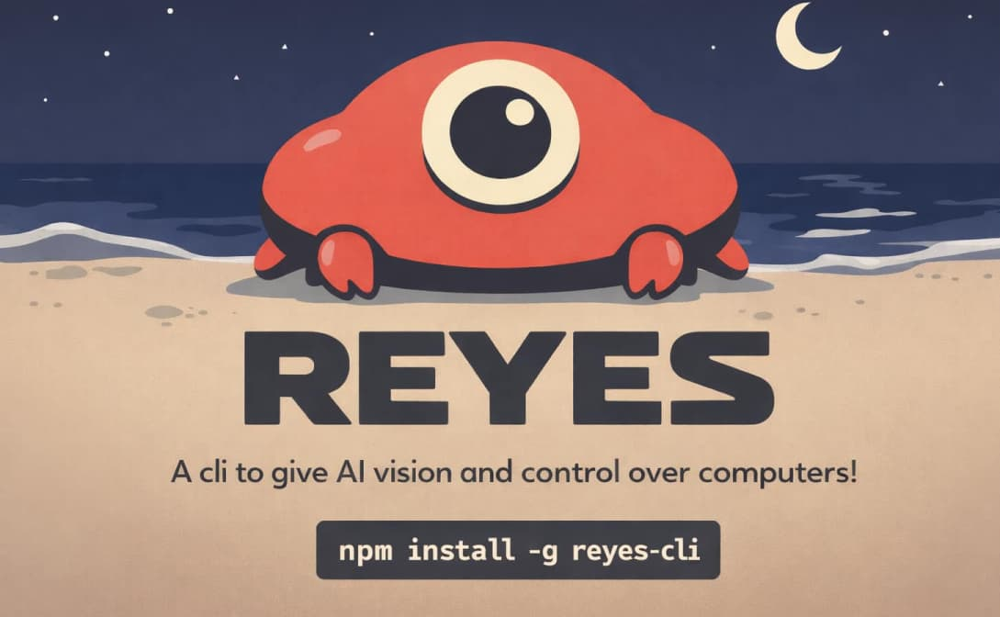

# 👁️ Reyes - Rust eyes for computer-use agents



A comprehensive computer-use CLI built on rustautogui that gives AI vision and control over your computer.

```sh
npm install -g reyes
```

## Overview

Reyes provides AI agents with the "eyes" and "limbs" to interact with the desktop environment. Built on the high-performance rustautogui library, it offers:

- **Screenshot & Vision** 📸: Capture screen regions, get pixel colors
- **Mouse Control** 🖱️: Click, move, drag, scroll with natural animations
- **Keyboard Control** ⌨️: Type text, press keys, execute hotkeys
- **Image Recognition** 🔍: Find and interact with UI elements using template matching
- **System Information** 📊: Query screen size, mouse position

All commands return JSON-formatted results, making it perfect for AI automation workflows.

## Features

- 🚀 **Fast**: Built on rustautogui's optimized template matching algorithms
- 🌐 **Cross-platform**: Windows, macOS, and Linux (X11) support
- 🤖 **AI-friendly**: JSON output for easy parsing
- 📦 **Comprehensive**: 30+ commands covering all automation needs
- ✅ **Production-ready**: Properly handles errors and edge cases

## Installation

### From crates.io (Recommended)

```bash
cargo install reyes
```

### From Source

```bash
git clone https://github.com/Blankeos/reyes.git
cd reyes
cargo install --path .
```

### System Requirements

**Linux:**

```bash
sudo apt-get update
sudo apt-get install libx11-dev libxtst-dev
```

**macOS:**

- Grant accessibility permissions when prompted
- System Preferences > Security & Privacy > Accessibility

**Windows:**

- No additional dependencies required

## Quick Start

```bash
# Take a screenshot
reyes screenshot --output screen.png

# Get mouse position
reyes get-mouse-position

# Move and click
reyes move-mouse --x 500 --y 300 --duration 0.5
reyes click

# Type text
reyes type-text --text "Hello from Reyes!"

# Press a key
reyes press-key --key enter

# Find image on screen
reyes locate-on-screen --image button.png --confidence 0.9
```

## Commands

### 📸 Screenshot

- `screenshot` - Capture screen to file
- `get-pixel-color` - Get RGB/Hex color at coordinates
- `find-color` - Search for specific color on screen

### 🖱️ Mouse Control

- `click` - Click at position
- `double-click` - Double click at position
- `move-mouse` - Move to absolute position
- `move-mouse-rel` - Move relative to current position
- `drag-mouse` - Drag to position
- `scroll` - Scroll wheel
- `get-mouse-position` - Get current coordinates
- `mouse-down` / `mouse-up` - Press/release buttons

### ⌨️ Keyboard Control

- `type-text` - Type string
- `press-key` - Press single key
- `hotkey` - Press key combination
- `shortcut` - Common shortcuts (copy, paste, etc.)
- `key-down` / `key-up` - Press/release keys

### 🔍 Image Recognition

- `locate-on-screen` - Find image location
- `locate-all-on-screen` - Find all instances
- `wait-for-image` - Wait for image to appear
- `wait-for-image-to-vanish` - Wait for image to disappear
- `click-on-image` - Click when image found
- `store-template` / `find-stored-template` - Template management

### ⚙️ System

- `get-screen-size` - Get display resolution
- `sleep` - Pause execution
- `print-mouse-position` - Track mouse movement

## Example Workflows

### Form Automation

```bash
reyes click --x 100 --y 100
reyes type-text --text "John Doe"
reyes press-key --key tab
reyes type-text --text "john@example.com"
reyes shortcut --name submit
```

### Image-Based Interaction

```bash
# Wait for button and click
reyes click-on-image --image submit.png --confidence 0.9 --duration 0.5

# Or find location first
location=$(reyes locate-on-screen --image icon.png --confidence 0.9)
echo "Found at: $location"
```

### Drag and Drop

```bash
reyes move-mouse --x 100 --y 100 --duration 0.5
reyes mouse-down --button left
reyes move-mouse --x 400 --y 400 --duration 1.0
reyes mouse-up --button left
```

## Response Format

All commands return JSON:

```json
// Success
{"success": true, "message": "Clicked at (100, 200)"}

// Position
{"x": 500, "y": 300}

// Image match
{
  "found": true,
  "locations": [[100, 200, 0.95]]
}
```

## For AI Agents

Reyes is designed for AI automation:

1. ⚛️ **Atomic Operations**: Each command is independent
2. 📋 **JSON Output**: Easy to parse programmatically
3. 🔚 **Exit Codes**: Non-zero on errors
4. 👁️ **Computer Vision**: Find UI elements by image
5. 🌊 **Natural Interactions**: Smooth mouse movements

See `SKILL.md` for detailed AI agent documentation.

## Performance Tips

1. **Use Regions**: Limit search areas for faster image recognition
2. **Store Templates**: Reuse prepared images for repeated searches
3. **Choose Match Mode**: Segmented for small/simple images, FFT for large/complex
4. **Adjust Confidence**: 0.9 for precise, 0.8 for fuzzy matching

## Platform Notes

- 🍎 **macOS**: Requires accessibility permissions; handles Retina displays automatically
- 🐧 **Linux**: X11 only (Wayland not supported); can search all monitors
- 🪟 **Windows**: Searches main monitor only; no additional setup needed

## Contributing

Contributions welcome! Please ensure:

- 🦀 Code follows Rust best practices
- 🛡️ All commands have proper error handling
- 📋 JSON output is consistent
- 📝 Documentation is updated

## License

MIT License - See LICENSE file

## Author

**Carlo Taleon** ([@Blankeos](https://github.com/Blankeos))

## Acknowledgments

Built on [rustautogui](https://github.com/DavorMar/rustautogui) by DavorMar

Inspired by PyAutoGUI and the computer-use paradigm

## Roadmap / Future Improvements

### Subagent Integration (Vision Models)

Planned integration with models.dev for advanced AI-powered vision capabilities:

- **`subagent-explain`** - Connects to models.dev to return human-readable descriptions of images. Supports prompt-based queries for specific details.

- **`subagent-point`** - Uses a subagent to locate text or objects on screen and returns precise coordinate points.

- **`subagent-detect`** - Returns bounding boxes and center point coordinates for detected objects/text.

- **`subagent-segment`** - Returns coordinate arrays representing segmentation boundaries.

### Subagent Configuration

A configuration command to customize the models.dev connection:

```bash
# Configure default connection
reyes configure-subagent --endpoint https://models.dev --api-key <key>

# Configure task-specific models
reyes configure-subagent --task explain --model claude-3-opus
reyes configure-subagent --task segment --model gpt-4-vision
reyes configure-subagent --task detect --model gemini-pro-vision
```

### Other Planned Features

- [ ] Clipboard operations (copy/paste content)
- [ ] Window management (list, focus, resize windows)
- [ ] OCR support for text recognition
- [ ] Recording and playback of macro sequences
- [ ] Configuration file support for default settings
- [ ] Interactive REPL mode with command history
- [ ] Integration with other vision APIs (OpenAI, Anthropic, etc.)
